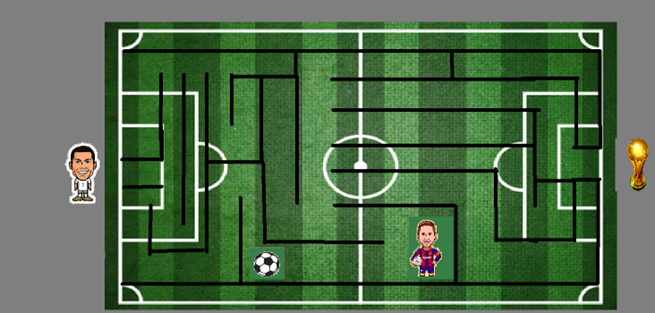
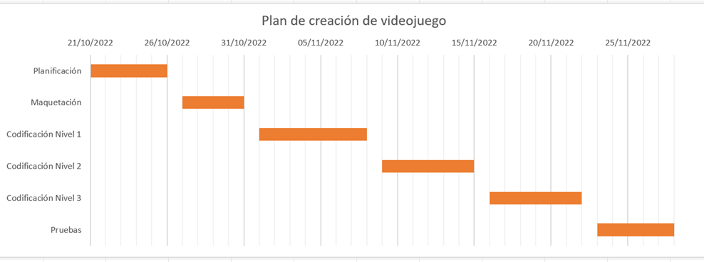

# Creación de Video Juego

    

## Contenido

- [Introducción](#introducción)
- [Código Fuente](#código-fuente)
- [Planificación](#planificación)
- [Autores](#autores)
- [Copyright](#copyright)

## Introducción

- Nombre del proyecto: CR7 Champion.

- Objetivo: El jugador tendrá que pasar por una serie de niveles los cuales se desarrollaran dentro de un laberinto con la finalidad de que el personaje principal (limite de tiempo) llegué a la copa del mundo y así logré ganar el juego.

- Plataforma: PC
- Modelado del juego: 3D
- Género: Aventura
- Clasificación: Clasificación “A”: Contenido para todo el público
- Personajes: Cristiano Ronaldo: Personaje principal que buscará lograr la obtención de la copa del mundo.

  Lionel Messi: Personaje secundario el cual es el que hurto la copa del mundo.
- Escenario: El juego se desarrollará dentro de un escenario similar al de un campo de fútbol, además de ello, los bloques del laberinto serán bloques de concreto 

- Historia: El juego relata la historia de un jugador de fútbol que lleva por nombre Cristiano Ronaldo que usa el dorsal 7 dentro de la selección de PT, su objetivo principal se centra en conseguir la copa del mundo, el cual es el único título que le falta dentro de sus filas, es por ello por lo que está en busca de ella para ser campeón y ser el mejor jugador del mundo. Messi ha robado la copa del mundo de Qatar 2022, se menciona que la ya mencionada ha sido llevado a una serie de laberintos los cuales tienen que ser pasados de manera exitosa para que dentro del último nivel el ganador se lleve la copa. Es por ello por lo que CR7 al ver la situación se ofrece cruzar esos niveles a pesar del riesgo que conlleva, pasando por varios retos como el toparse con Messi y así mismo lograr esquivarlo además bonificaciones para la obtención del título. ¿Logrará CR7 volver con la copa y así mismo ser campeón?

-Niveles:

Nivel 1: El jugador empezará recorriendo el lugar del laberinto, donde podrá ir recogiendo bonus (relojes), estos se empezarán a sumar tiempo en el nivel. Al recoger la copa el player tendrá que encontrar la salida en alguna de las 4 puertas.

Nivel 2: El jugador seguirá recorriendo el lugar del laberinto, y de igual manera tendrá que recoger bonus, sin embargo, ahora el juego tendrá más dificultad y además el terreno del juego será más grande, dado por hecho que será aún más difícil. El player de igual manera tendrá que encontrar la copa para poder terminar el nivel y asi ganar.

- Reglas de Juego: 

1. El player deberá evitar los obstáculos esquivándolos, para poder llegar al final del nivel.

2. Para llegar al final del juego, el player deberá concluir los 3 niveles solicitados.

3. El player no podrá hacer trampa alguna para concluir algún nivel.

4. El player deberá seguir teniendo créditos para no dejar de jugar, por lo contrario, se acabará el juego.

- Pantallas de Juego :
 

## Código Fuente

<!-- * Lección 1
  * > Tutorial
  * > Laboratorio
  * > Desafío
  * > Prueba
* Lección 2
  * > Tutorial
  * > Laboratorio
  * > Desafío
  * > Prueba -->
* Lección 1

 

[Unidad 1 - El control del Jugador](https://github.com/Creacion-de-Videojuegos-GDGS2101/units-games/tree/master/Unidad%201/Leccion1)

[Unidad 1 - Lab 1](https://github.com/Creacion-de-Videojuegos-GDGS2101/units-games/tree/master/Unidad%201/Lab1)

[Unidad 1 - Challenge 1](https://github.com/Creacion-de-Videojuegos-GDGS2101/units-games/tree/master/Unidad%201/Desafio)

[Unidad 1 - Evidencia Quiz (video)](https://github.com/Creacion-de-Videojuegos-GDGS2101/units-games/blob/master/Unidad%201/Evidencias%20Prueba%201%20y%20Prueba%202.mkv)

* Lección 2

 

[Unidad 2 - Jugabilidad Basica](https://github.com/Creacion-de-Videojuegos-GDGS2101/units-games/tree/master/Unidad%202/Leccion2)

[Unidad 2 - Lab 2](https://github.com/Creacion-de-Videojuegos-GDGS2101/units-games/tree/master/Unidad%202/Lab2)

[Unidad 2 - Challenge 2](https://github.com/Creacion-de-Videojuegos-GDGS2101/units-games/tree/master/Unidad%202/Desafio2)

[Unidad 2 - Evidencia Quiz (video)](https://github.com/Creacion-de-Videojuegos-GDGS2101/units-games/blob/master/Unidad%202/Evidencias%20Prueba%201%20y%20Prueba%202.mkv)

* Lección 3

 

[Unidad 3 - Sonido y efectos](https://github.com/Creacion-de-Videojuegos-GDGS2101/units-games/tree/master/Unidad%203/Leccion-3)

[Unidad 3 - Lab 3](https://github.com/Creacion-de-Videojuegos-GDGS2101/units-games/tree/master/Unidad%203/Lab-3)

[Unidad 3 - Challenge 3](https://github.com/Creacion-de-Videojuegos-GDGS2101/units-games/tree/master/Unidad%203/challenge%20-3)

[Unidad 3 - Evidencia Quiz (video)](https://github.com/Creacion-de-Videojuegos-GDGS2101/units-games/blob/master/Unidad%203/evidencia%20quiz%20unit%203.mkv)

* Lección 4

 

[Unidad 4 - Gameplay Mechanics](https://github.com/Creacion-de-Videojuegos-GDGS2101/units-games/tree/master/Unidad%204/Leccion4)

[Unidad 4 - Lab 4](https://github.com/Creacion-de-Videojuegos-GDGS2101/units-games/tree/master/Unidad%204/Laboratorio4)

[Unidad 4 - Challenge 4](https://github.com/Creacion-de-Videojuegos-GDGS2101/units-games/tree/master/Unidad%204/Desafio4)

[Unidad 4 - Evidencia Quiz (video)](https://github.com/Creacion-de-Videojuegos-GDGS2101/units-games/blob/master/Unidad%204/evidencia%20quiz%204.mkv)

* Lección 5

 

[Unidad 5 - Interfaz de usuario](https://github.com/Creacion-de-Videojuegos-GDGS2101/units-games/tree/master/Unidad%205/Leccion5)

[Unidad 5 - Lab 5](https://github.com/Creacion-de-Videojuegos-GDGS2101/units-games/tree/master/Unidad%205/Laboratorio5)

[Unidad 5 - Challenge 5](https://github.com/Creacion-de-Videojuegos-GDGS2101/units-games/tree/master/Unidad%205/Desafio5)

[Unidad 5 - Evidencia Quiz (video)](https://github.com/Creacion-de-Videojuegos-GDGS2101/units-games/blob/master/Unidad%205/evidenciia%20quiz%205.mkv)

* VideoJuego

[Version Final Assets](https://github.com/Creacion-de-Videojuegos-GDGS2101/units-games/tree/master/Version%20Final)

[Deploy](https://github.com/Creacion-de-Videojuegos-GDGS2101/units-games/tree/master/Deploy)

## Planificación

- Plan de creación de VideoJuego :

 

## Autores
José Guillermo Balderas Zamora y Carlos Eduardo Miranda Valtierra

## Copyright
Derechos Reservados 2022 
